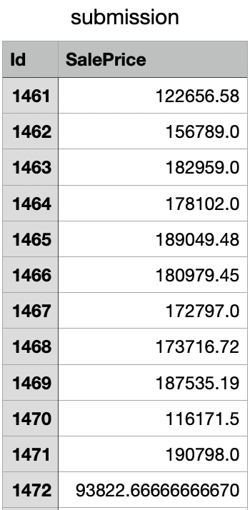

# 🏠 House Price Prediction

This project showcases a **House Price Prediction** model developed for a Kaggle competition.  
The goal was to predict house prices based on various features such as area, number of rooms, location, etc.  

---

## 📘 Description

This project uses a **Random Forest Regressor** to predict house prices.  
The dataset was taken from Kaggle and cleaned to handle missing values and outliers.  
Feature engineering was performed to improve model accuracy.

---

## 🧠 Techniques Used

- Data preprocessing and feature selection  
- Handling missing values and categorical encoding  
- Model training using **Random Forest Regressor**  
- Hyperparameter tuning using **GridSearchCV**  
- Model evaluation using **Mean Absolute Error (MAE)**  

---

## 📊 Results

- Compared different tree sizes to find the ideal model complexity  
- Improved prediction speed by optimizing data preprocessing  
